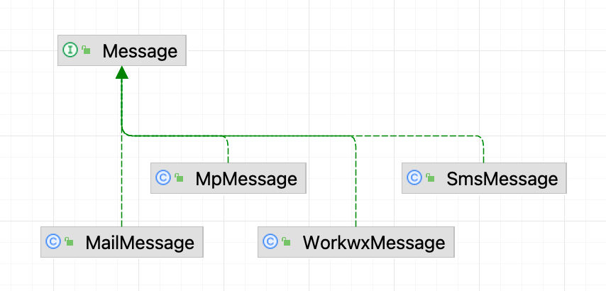
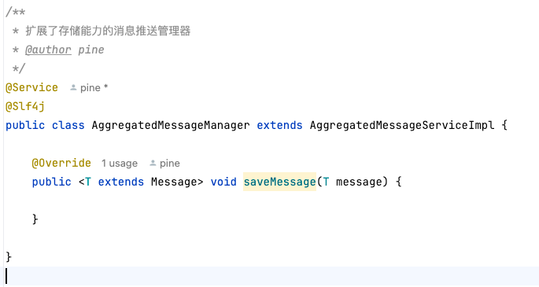

# 消息推送 SDK

## 背景
在开发中，我们经常会通过各种渠道通知用户，为了复用和简化通知功能的开发量，我们开发了本 sdk。

## 快速开始

### 引入依赖
> 当前最新版本是 0.0.5
```xml
<dependency>
    <groupId>io.github.yuyuanweb</groupId>
    <artifactId>message-sdk</artifactId>
    <version>version</version>
</dependency>
```
### 加入配置
```yaml
tencent:
  # 腾讯短信服务
  sms:
    secretId: xxx
    secretKey: xxx
    sdkAppId: xxx
    signName: xxx
  ses:
    secretId: xxx
    secretKey: xxx
    user: xxx
    password: xxx
    nickName: xxx
notify:
  workwx:
    webhook: xxx
wx:
  mp:
    token: xxx
    appId: xxx
    aesKey:
    secret: xxx
    config-storage:
      http-client-type: HttpClient
      key-prefix: xxx
      redis:
        host: 127.0.0.1
        port: 6379
      type: Memory
```
如上图示例配置所示，目前支持 **短信、邮箱、企微、微信服务号** 四种方式，在使用某种方式之前，需要先填入对应的配置

### 测试使用
> **重要:** 当不需要使用微信服务号推送时，请在 @SpringBootApplication 上排除 wxJava 的自动装配
> ```java
> @SpringBootApplication(exclude = {WxMpAutoConfiguration.class})
> ```
```java
@SpringBootTest
class MessageSdkApplicationTests {

    @Resource
    private AggregatedMessageServiceImpl aggregatedMessageServiceImpl;

    @Test
    void contextLoads() {

        WorkwxMessage workwxMessage = new WorkwxMessage();
        workwxMessage.setContent("??test哈哈哈😋");
        aggregatedMessageServiceImpl.send(workwxMessage);

    }

}
```
在上述例子中，我们创建了 WorkwxMessage 对象，然后使用 AggregatedMessageServiceImpl 发送出去，这样就成功发送了一条企微的通知消息。
同样，需要发送其他类型的消息时，只需要创建对应的消息对象，然后使用 AggregatedMessageServiceImpl 的 send 方法就可以了。
所支持的消息都是 Message 的子类：


## 扩展
1）有时候，我们需要把本次发送的消息存到数据库，或者做一些其他的后置操作，这时候只需要继承 AggregatedMessageServiceImpl 并实现其中的 saveMessage 方法就可以实现。
像这样：

之后仍然可以通过注入 AggregatedMessageServiceImpl 对象的方式使用。

2）AggregatedMessageServiceImpl 只提供了最基础的发送功能，比如对于企微消息，只能发送纯文本，不支持富文本或 markdown 格式。
有相关需求可以通过在程序中注入对应实现类的方式使用：
```java
@Resource
private WorkwxMessageServiceImpl workwxMessageServiceImpl;
```